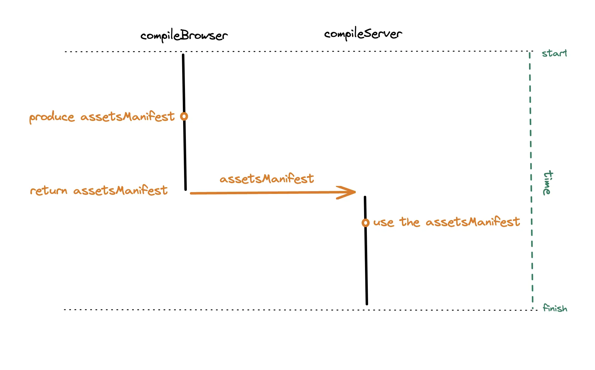
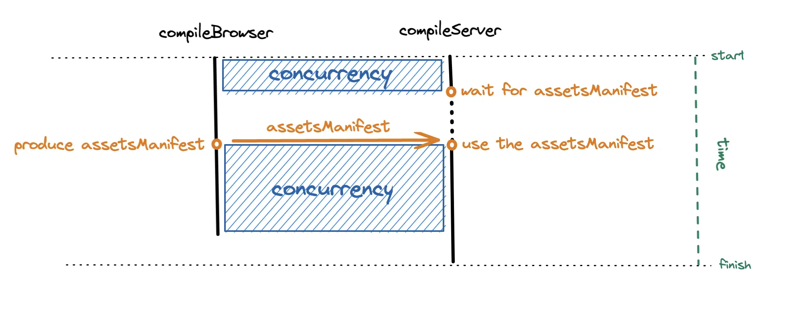

# Go-like channel in 10 lines of Javascript

For the Remix compiler, I wanted to code the browser and server builds so that they could be concurrent.

Specifically, there's an assets manifest that the browser build produces part way through that is needed  somewhere in the server build.

```ts
async function compileBrowser() {
  // do stuff
  let assetsManifest = /* ... */
  // do more stuff
  return assetsManifest
}

async function compileServer(assetsManifest) {
  // do stuff
  let config = createServerConfig(assetsManifest)
  // do more stuff
}

function compile() {
  let assetsManifest = await compileBrowser()
  compileServer(assetsManifest)
}
```

The contents of the assets manifest aren't important for this conversation.
It's just a value we need to coordinate the handoff for between the browser build and the server build.

Right now we have to wait for `compileBrowser` to finish before we even pass `assetsManifest` to `compileServer`:



There's no hope of concurrency if we stick with this approach.

Ideally, `compileBrowser` and `compileServer` could initially run concurrently, then the server waits until the browser build produces the assets manifest, and then they can finish concurrently:



Javascript has callbacks, promises, and `async`/`await` for concurrency.
I _could_ have used those, but they all felt like the wrong tool.
In this situation, I found it more intuitive to use Go's concurrency model for channels.

## Using channels for concurrency

With [Go channels](https://go.dev/tour/concurrency/2), functions can coordinate by writing and reading from the channel:

```ts
async function compileBrowser(channel: WriteChannel<AssetsManifest>) {
  // do stuff
  let assetsManifest = /* ... */
  channel.write(assetsManifest)
  // do more stuff
}

async function compileServer(channel: ReadChannel<AssetsManifest>) {
  // do stuff
  let assetsManifest = await channel.read() 
  let config = createServerConfig(assetsManifest)
  // do more stuff
}

async function compile() {
  let channel = createChannel<AssetsManifest>()
  let browserPromise = compileBrowser(channel)
  let serverPromise = compileServer(channel)
  Promise.all([browserPromise, serverPromise])
}
```

Note that in `compile`, we kick off both `compileBrowser` and `compileServer` asynchronously.
We also get the added benefit that `compileBrowser` and `compileServer` explicitly state if they _write_ or _read_ the assets manifest.

If only we had Go-like channels in Javascript...

## Implementing channels in Javascript

The insight is to realize channels are like _remotely-resolvable_ promises:

```ts
export type WriteChannel<T> = {
  write: (data: T) => void;
};
export type ReadChannel<T> = {
  read: () => Promise<T>;
};
export type Channel<T> = WriteChannel<T> & ReadChannel<T>;

export const createChannel = <T>(): Channel<T> => {
  let promiseResolve: (value: T) => void;

  let promise = new Promise<T>((resolve) => {
    // save this promise's `resolve` for later
    promiseResolve = resolve;
  });

  return {
    write: promiseResolve!,
    read: () => promise,
  };
};
```

Ignoring the Typescript type definitions, its **only 10 lines of Javascript**!

To be fair, Go channels are more sophisticated and let you queue a bunch of writes into them, waiting to be read.[^producer-consumer]
If you need something like that checkout [some](https://github.com/js-csp/js-csp) [of](https://github.com/skozin/cochan) [these](https://github.com/gozala/channel) [packages](https://github.com/NodeGuy/channel).

[^producer-consumer]: This is called the [Producer-Consumer pattern](https://en.wikipedia.org/wiki/Producer%E2%80%93consumer_problem#Using_channels).

What we've implemented is a "first write wins" channel.
When `channel.write(value)` is called the first time, that value will persist.
Any subsequent writes will be discarded.

That works great for this problem as we create a new channel for each build, so we only need to write to it once.
And check out how similar our `compile` function is to the [_actual_ `compile` function in the Remix compiler](https://github.com/remix-run/remix/blob/%40remix-run/dev%401.7.5/packages/remix-dev/compiler/remixCompiler.ts#L31-L34)!