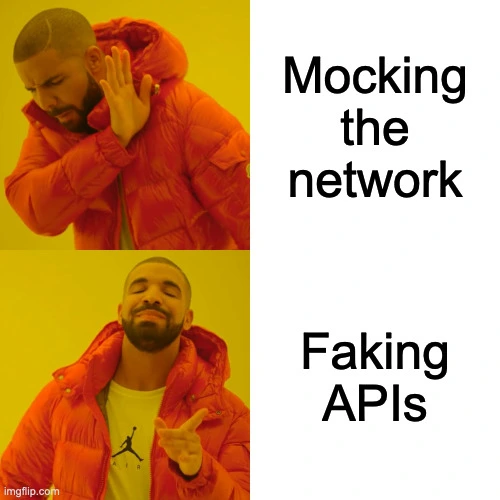

# Offline dev and testing for Remix

Faking your APIs with MSW is great, but if you're using `remix dev` as your dev server, setting up MSW can be tricky.

---

If you're building a Remix app, its extremely likely that you'll have some loaders that fetch data from some Web API.
For example, you may be pulling markdown files for your blog from GitHub or some other CMS.[^cms]

```ts
// app/routes/blog/$id.tsx
import { type LoaderArgs, json } from "@remix-run/node"

const loader = async ({ params }: LoaderArgs) => {
  let { id } = params

  // get markdown from cms
  let res = await fetch(`https://some-cms-service.com/api/blog-posts/${id}`)
  let data = await res.json()

  // use remark/rehype or some other toolchain to parse/render the markdown
  let parsed = parse(data)

  return json({ html: parsed })
}
```

[^cms]: Using a CMS let's you deploy content changes simply by changing the content on your CMS. No app deploy required!

That's a solid architecture for production.
But in development and testing environments there are some big flaws.

How can you develop on your app offline, say on a long flight?
How do you test your app—reliably, deterministically, and rapidly—now that it depend on a network connection?

You don't want to get rate limited by your CMS.[^server-side-cache]
And that's not even considering that you might be hitting APIs with real world consequences like sending an email or making a payment! 😬

[^server-side-cache]: In production, you could use a server-side cache like [lru-cache](https://www.npmjs.com/package/lru-cache) to speed up your Remix server responses and avoid rate limits. Note that server-side caching will only work for hosting providers that actually give you a persistent server, not an ephemeral cloud function that acts as your server.

## Mocking vs faking

You could alter your app architecture to make it easier for dev or testing, but then you're [catering to the test user](https://kentcdodds.com/blog/testing-implementation-details).

You could also try to mock your data fetches, but that's [not a great choice either](https://kentcdodds.com/blog/stop-mocking-fetch).

The key insight is to _fake_ the APIs you're using!

But I just said not to _mock_ the network and isn't faking those APIs the same thing?
No!

It's just one word, but it makes all the difference.
It's hard to properly define "mocking" and "faking" since they are used widely and loosely, but I'll share the definitions that make the most sense to me.

**Mocking** is about checking that certain methods were called and maybe substituting those methods with some ad-hoc ones for testing.
It peeks inside the interface for an existing implementation and alters it.
What I don't like about this is that you're back to [testing implementation details](https://kentcdodds.com/blog/testing-implementation-details).

**Faking** is about creating a _completely new_ implementation for an interface that takes shortcuts where necessary, focusing solely on parts relevant to your dev or test environment.
Faking respects interface boundaries that already exist in your app and plugs in a _fake_ implementation.



You may disagree with these definitions and that's fine.
The labels we use aren't the interesting part, but rather the behavior.

## Faking APIs

You could use different tools or methods to fake the APIs, but I recommend [Mock Service Worker](https://mswjs.io/).

Wait... **mock** service worker?! 🤦
Like I said, reasonable people disagree about where exactly to draw the line between these testing terms.
But I assure you, we're using MSW to _fake_ the APIs.

To set this up you'll need:
1. A server that intercepts API calls to the APIs you're using
2. Request handlers for the API endpoints you'd like to fake

For example, if you're using GitHub as a CMS you could fake it like this:

```ts
// msw/server.ts
import type { SetupServerApi } from "msw/node"
import { setupServer } from "msw/node"

import { handler as githubHandler } from "./github"

const handlers = [githubHandler]

export const setup = () => setupServer(...handlers)

export const start = (server: SetupServerApi) => {
  server.listen({ onUnhandledRequest: "error" })
  process.once("SIGINT", () => server.close())
  process.once("SIGTERM", () => server.close())

  console.info("🔶 Mock server")
}
```

```ts
// msw/github.ts
export const handler = rest.get(
  "https://api.github.com/repos/:owner/:repo/contents/*",
  async (req, res, ctx) => {
    // your fake implementation goes here
    // e.g. read files from a local clone of the repository
    return res(ctx.status(200), ctx.json(contents))
  })
```

## The Remix "global" trick

Now that you have your MSW fake server setup, you could simply create a server instance and start it within your `entry.server.tsx`:[^msw-env-var]

```ts
// app/entry.server.tsx
import { setup, start } from "../msw/server"

if (process.env.NODE_ENV === "development" || process.env.NODE_ENV === "test") {
  let server = setup()
  start(server)
}
```

[^msw-env-var]: You could also make a dedicated MSW environment variable if you want the flexibility to run in dev mode with and without faking APIs. For example, if you wanted dev builds that were easier to debug, but wanted to try hitting your actual CMS.

But, Remix live reloads your server during development, so you'll end up creating multiple instances of your MSW server and likely get warnings about it.

Usually, we could just use Node's `--require` flag to run our MSW server alongside our main app server:

```sh
# ./build/index.js is where Remix typically builds your server to
node --require ./msw/start-server.ts ./build/index.js
```

And that works... unless you're using the Remix dev server: `remix dev`.
Since you aren't running `node` yourself for the Remix dev server, there isn't a `--require` flag for you to use for the MSW server.

To circumvent this, you can use the [same `global` trick from the Remix Jokes app tutorial](https://remix.run/docs/en/v1/tutorials/jokes#connect-to-the-database):

```ts
// msw/index.ts
import { setup, start } from "./server"

declare global {
  var __isFaking: boolean | undefined
}

export const startOnce = () => {
  if (!global.__isFaking) {
    const server = setup()
    start(server)
    global.__isFaking = true
  }
}
```

This ensures we only setup and start our MSW server once everytime the server spins up, even if live reloads happen.[^node-api-for-dev-server]

[^node-api-for-dev-server]: I've made a [proposal for a Node API for the Remix compiler and dev server](https://github.com/remix-run/remix/discussions/4547) which would let us more precisely purge the require cache. I _think_ that would make the "global" trick obsolete.

The awesome thing about this approach is that its universal.
It also works for Javascript or Typescript and it works for _any_ dev server.

## Further reading

I've already linked to Kent C Dodd's article a couple times in this post, but the most relevant are:

- [Testing Implementation Details](https://kentcdodds.com/blog/testing-implementation-details)
- [Stop Mocking Fetch](https://kentcdodds.com/blog/stop-mocking-fetch)
