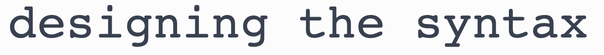

# snake_case_is_the_best_case

If you're working with code that already has a case style, just use that.
An imperfect convention is better than two competing ones.

But when you need to decide on one, pick `snake_case` 🐍.

## Ideas need names

Sketching out an idea is invaluable; I highly recommend it.
Boxes and arrows on a whiteboard convey so much data quickly, clearly, and concisely.
But which box is which?
What does this arrow mean?
What is this whole diagram about?

You need to label these things.
**Ideas need names.**

In code, variables, classes, and functions[^anonymous-functions] need names,
but names can't contain spaces.
So what to do for names with multiple words?
What should you use instead of spaces?

The key is to take advantage of your perception.

## Prose-based perception

You first learned how to read prose 📖 and then you honed that skill over _decades_.
You read books, text messages, news articles, instruction manuals...
You also learned to write prose.
Writing prose shapes the way you think, letting you transform vague inspirations into clear plans and ideas.

Your eyeballs 👀 and [meat computer][meat-computer] 🧠 have been relentlessly fine-tuned for reading and writing prose.

What techniques does your prose-optimized perception use?
And are there code styles that tap into those?

## Word shapes

My intuition is that our perception uses word shapes as a shortcut to detect word boundaries and identify individual words.
By "shapes", I mean the silhouettes of each word.


`snake_case` replaces spaces with underscores, which are excellent at preserving word shapes.
`PascalCase` and `camelCase` remove spaces and uppercase leading characters, disrupting word shapes.
The leading uppercase at least preserves most of the word shape, but removing spaces probably makes it harder to quickly
detect word boundaries.

`kebab-case` fares much better.
It preserves individual word shapes as well as `snake_case`, but hyphens `-` occupy areas normally used by letters whereas underscores `_` stay out of the way.
Makes sense; hyphens are _literally_ a way of joining separate words.
But my guess is that this probably hurts your ability to detect word boundaries, even if just a little.[^kebab-case-aesthetics]

Remember that "word shapes" as a heuristic for perception is just speculation on my part.
I would be shocked if our perception didn't use word shapes at all,
but it's important not to draw too many conclusions without controlled studies.[^transposed-letter-effect]

## Visual similarity

Intuitively, code that is most _visually similar_ to prose could best reuse your prose-reading abilities.

Let's figure out what "visually similar" means for code.
One idea is to use [edit distance][edit-distance] to measure it.
The smaller the edit distance, the more visually similar.
I think an even better idea is use [visual regression testing][visual-regression-testing]
to visualize the difference between prose and code.



It doesn't matter if you like the numerical objectivity of edit distance or the visceral clarity of visual regression diffs,
it's clear that `snake_case` is the victor.[^edit-distance]

If you want more scientific evidence, you're in luck!
There's a [controlled study examining code comprehension][camelCase-vs-snake_case] that compares `snake_case` and `camelCase`.
Unsurprisingly, `snake_case` comes out on top.

## One obvious way

Unlike other case types, `snake_case` has one obvious way to write names:

1. Express the idea in prose 👉 "fetch RSS feed as XML"
2. Replace spaces with underscores 👉 `fetch_RSS_feed_as_XML` [^rare-underscores]
3. Lowercase it 👉 `fetch_rss_feed_as_xml` [^lowercase]
4. That's it! 🎉

With other cases, you need to decide how acryonyms should be capitalized: `fetchRssFeedAsXml` or `fetchRSSFeedAsXML`?
Should you _always_ CAPS LOCK acryonyms?
Or never do so?
The issue is that you are using capital letters syntactically (to split up words) _and_ semantically (to convey acronyms),
so there's not a good rule that always works.
Your choices are:

- a) Follow a flawed rule ❌
- b) Decide how to capitalize acronyms over, and over, and over, and over, ... ❌

In `snake_case` it's just `fetch_rss_feed_as_xml`.
You can focus on the semantics of your code instead of spending time deciding on syntactics.
It's like having a formatter for your names.
It's so systematic that you could trivially implement `snake_case` naming in code:

```ts
let to_snake_case = (prosey_name: string) =>
  prosey_name.replace(" ", "_").toLowerCase();
```

You'll also get some bonuses from using lowercased names:

1. Compatibility across case-sensitive (Linux) and case-insensitive (MacOS and Windows) filesystems
2. Simple renaming with `s/old_name/new_name/g` since `foo` and `is_foo` aren't capitalize differently[^vim-abolish]

## Affordance of Capital Letters

Since capital letters are not used syntactically in `snake_case`, they can instead be used to convey semantics.
In prose, capital letters are useful for indicating proper nouns.
To me, namespaces and classes feel most like proper nouns so I like using capital letters as an affordance for those.

```ts
// `Order` is a namespace, `order` is a variable
let order = Order.new();
```

Python, like many languages, uses `PascalCase` for classes.
It works fairly well, though I still don't like that capital letters convey syntax and semantics.

As an alternative for new programming languages, I propose a `snake_case` variant that capitalizes the first letter of the first word.
I call it `Cobra_case` since the first letter is reminiscent of how a cobra lifts its hooded head upright.
Then, the capital letters in `Cobra_case` names serve as an affordance for namespaces or classes.

Lastly, `SCREAMING_SNAKE_CASE` can keep its affordance as a naming convention for constants.

## Longer names are fine

One argument I hear against `snake_case` is that it's longer than `camelCase`.
It's true that `fetch_rss_feed_as_xml` has four more characters than `fetchRSSFeedAsXML`,
but why is that a bad thing?

What makes a name good or bad isn't its length, but what it conveys to the reader.
If your variable name is long because you have `Object` or `Factory` in it, I bet you can rename it with [domain-related words][domain-driven] instead.
Once you have a good descriptive name, tools like autocomplete, snippets, and GitHub Copilot will make writing it fast and easy.[^shift-space]

I also get that your formatter might complain about lines over a certain length.
Ideally, you could just increase that length since modern editors don't have line length limitations.
Otherwise you'll have to shorten your name, either by coming up with one that was just as good or by sacrificing some descriptive power.

[meat-computer]: https://www.mit.edu/people/dpolicar/writing/prose/text/thinkingMeat.html
[edit-distance]: https://en.wikipedia.org/wiki/Edit_distance
[visual-regression-testing]: https://applitools.com/blog/visual-regression-testing/
[camelCase-vs-snake_case]: https://whatheco.de/2013/02/16/camelcase-vs-underscores-revisited/

[^anonymous-functions]: Anonymous functions don't need names, but I doubt there are meaningful programs where _all_ the functions are anonymous.
[^kebab-case-aesthetics]:
    I like the aesthetics of `kebab-case`, but it is slightly harder to read that `snake_case`.
    Also, many programming languages do not support `kebab-case` for variable names.
    I do occasionally use `kebab-case` for filenames and URL path segments.

[^transposed-letter-effect]:
    The [tranposed letter effect](https://en.wikipedia.org/wiki/Transposed_letter_effect#Internet_meme) makes some intuitive sense along the same lines as "word shapes",
    but [its effect were overstated](https://www.mrc-cbu.cam.ac.uk/people/matt.davis/cmabridge/).
    I'd argue that my "word shapes" theory is substantially more likely since letter order matters, but like I said, probably best not to draw too many conclusions until the science lady sings.

[^edit-distance]:
    `snake_case` does exactly 1 replacement for every space whereas `camelCase` does 1 removal and 1 replacement (uppercasing first letter) for every space.
    Consequently, `snake_case` will have a lower edit distance than `camelCase`.

[^rare-underscores]: Underscores are exceedingly rare in names so `snake_case` tends to be a lossless encoding of the prosey name.
[^lowercase]:
    Acronyms in code should be familiar to you and your team, so lowercasing them doesn't hurt.
    If they aren't familiar, you'll want to use a more descriptive name in the first place.

[^vim-abolish]: There are tools like [vim abolish](https://github.com/tpope/vim-abolish) that will handle renames across different cases, but those are inherently more complex.

[domain-driven]: https://en.wikipedia.org/wiki/Domain-driven_design

[^shift-space]: I recommend that you keymap <kbd>Shift</kbd> + <kbd>Space</kbd> to insert an underscore so that `snake_case` becomes as convenient to write as normal prose.
