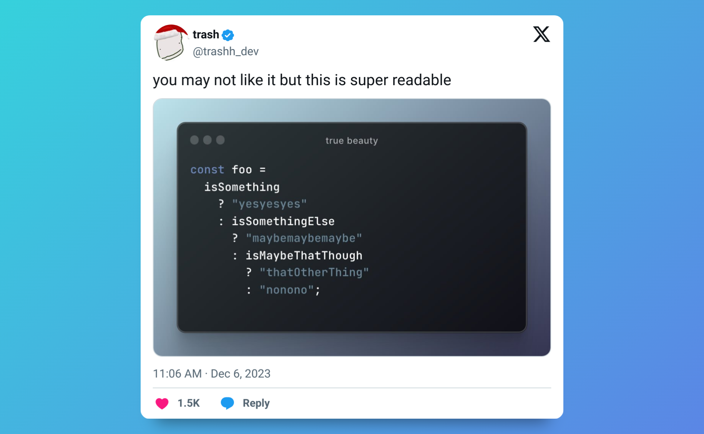
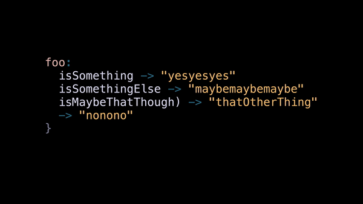
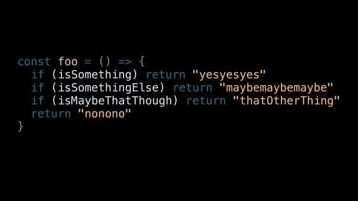
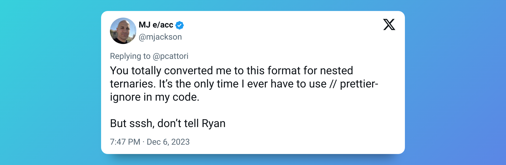
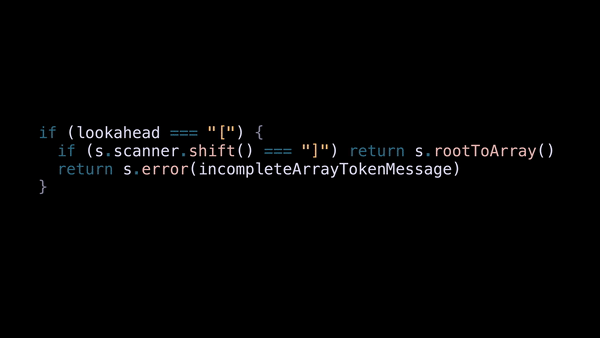

# Ternaries could be beautiful

Stumbled on this tweet the other day:

[][tweet]

Look, I don't think ternaries are evil.
Sometimes you just want conditional expressions, so you can't use early returns nor [`switch(true)`][switch-true],
like when your writing [conditional types in TypeScript][conditional-types].
Plus you don't want to go through the hassle of [IIFE][iife]s either.
In other languages, you might reach for [pattern matching][pattern-matching], but JavaScript doesn't have that ([yet][tc39-pattern-matching]).
And in those cases, ternaries might be a good choice.

But we all agree that formatting them like this is just plain ugly, right?

```ts
const foo = () =>
  isSomething
    ? "yesyesyes"
    : isSomethingElse
      ? "maybemaybemaybe"
      : isMaybeThatThough
        ? "thatOtherThing"
        : "nonono"
```

It always take me a hot second to figure out what's going on when ternaries are formatted this way.
Plus I'm starting to get neck pain from all the nested indentation.

Luckily, [Prettier][prettier] is looking into [how to better format ternaries][prettier-curious-ternaries]:

```ts
// prettier-ignore
const animalName =
  pet.isScary() ? 'wolf'
  : pet.canBark() ? 'dog'
  : pet.canMeow() ? 'cat'
  : 'probably a bunny'
```

Prettier calls this "case-style" ternaries.
And honestly, it's pretty good.

But you _already_ know a better way to format ternaries.
Don't believe me?

## Formatting early returns

Ok, let's rewrite it with `if` statements but keep the nesting:

```ts
const foo = () => {
  if (isSomething) {
    return "yesyesyes"
  } else {
    if (isSomethingElse) {
      return "maybemaybemaybe"
    } else {
      if (isMaybeThatThough) {
        return "thatOtherThing"
      } else {
        return "nonono"
      }
    }
  }
}
```

Eww.
Sorry, I had to show you that.

Anyway, you already know how these `if` statements should be formatted:

```ts
const foo = () => {
  if (isSomething) return "yesyesyes"
  if (isSomethingElse) return "maybemaybemaybe"
  if (isMaybeThatThough) return "thatOtherThing"
  return "nonono"
}
```

Ah, that's better.
But _why_ is it better?
And what does it teach us about formatting ternaries?

Oh, and don't fret the lack of `{}`.
You can write each `if` statement like this if you prefer:

```ts
if (isSomething) {
  return "yesyesyes"
}
```

It won't change any of the points we'll cover.

## Form from function

Here's the mental model I have for the semantics of our little example:

```txt
foo:
  isSomething -> "yesyesyes"
  isSomethingElse -> "maybemaybemaybe"
  isMaybeThatThough -> "thatOtherThing"
  -> "nonono"
```

Look familiar?



The nested formatting was giving a false affordance of complexity.
But with early returns, each case is on its own line so the syntax mirrors the semantics.
Form from function; function from form.

And it's not just nicer in theory, it has HUGE practical benefits.

- Want to add a case? Add a line.
- Want to remove a case? Delete or comment out that line.
- Want to change the priority of a case? Move that line up or down.



As a bonus, you'll get way less `git` noise when making any of these changes than you would with the nested formatting.

Ok, now try doing any of those with the nested formatting.
Yuck.

Another benefit is that it keeps the "happy path" or "interesting part" of the code unindented:

```ts
const fibonacci = (n: number) => {
  // base cases
  if (n === 0) return 0
  if (n === 1) return 1

  // interesting part
  return fibonacci(n - 1) + fibonacci(n - 2)
}

const login = (username?: string, password?: string) => {
  // preconditions
  if (!username) throw Error("Username required")
  if (!password) throw Error("Password required")
  if (!db.check(username, password)) throw Error("Invalid credentials")

  // interesting part
  let user = db.getUser(username)
  // ...bunch of other business logic...
  return redirect("/home")
}
```

So how'd we got from these semantics:

```txt
foo:
  isSomething -> "yesyesyes"
  isSomethingElse -> "maybemaybemaybe"
  isMaybeThatThough -> "thatOtherThing"
  -> "nonono"
```

to early return syntax?
You already know the answer:

> Replace `<condition> -> <result>` with `if (<condition>) return <result>`

Let's tweak that a little bit for ternaries;

> Replace `<condition> -> <result>` with `<condition> ? <result> :`

```ts
// prettier-ignore
const foo = () =>
  isSomething ? "yesyesyes" :
  isSomethingElse ? "maybemaybemaybe" :
  isMaybeThatThough ? "thatOtherThing" :
  "nonono"
```

Daaaayyyuumm ternaries, is that you? 🤩
You're lookin' good!


And I'm not the only one that thinks so:

[][mjackson-tweet]

Ok ok, that's all well and good for our simple example.
But how well does this technique scale in real code?

## Let's get real

Here's an example from [arktype][arktype-parse-operator] that's a little more complex:

```ts
// prettier-ignore
export const parseOperator = (s: DynamicState): void => {
  const lookahead = s.scanner.shift()
  return lookahead === ""
    ? s.finalize()
    : lookahead === "["
    ? s.scanner.shift() === "]"
        ? s.rootToArray()
        : s.error(incompleteArrayTokenMessage)
    : isKeyOf(lookahead, Scanner.branchTokens)
    ? s.pushRootToBranch(lookahead)
    : lookahead === ")"
    ? s.finalizeGroup()
    : isKeyOf(lookahead, Scanner.comparatorStartChars)
    ? parseBound(s, lookahead)
    : lookahead === "%"
    ? parseDivisor(s)
    : lookahead === " "
    ? parseOperator(s)
    : throwInternalError(writeUnexpectedCharacterMessage(lookahead))
}
```

Let's parse that into its semantics:

```txt
lookahead === "" -> s.finalize()
lookahead === "[" ->
    s.scanner.shift() === "]" -> s.rootToArray()
    -> s.error(incompleteArrayTokenMessage)
isKeyOf(lookahead, Scanner.branchTokens) -> s.pushRootToBranch(lookahead)
lookahead === ")" -> s.finalizeGroup()
isKeyOf(lookahead, Scanner.comparatorStartChars) -> parseBound(s, lookahead)
lookahead === "%" -> parseDivisor(s)
lookahead === " " -> parseOperator(s)
-> throwInternalError(writeUnexpectedCharacterMessage(lookahead))
```

Oh no, the second case is nested.
Seems like our simple `condition ? result :` rule wouldn't work here.
But really, our technique is just to think about how we'd format `if` statements and _copy that_.

For an `if` statement, we'd write:

```ts
//...
if (lookahead === "[") {
  if (s.scanner.shift() === "]") return s.rootToArray()
  return s.error(incompleteArrayTokenMessage)
}
//...
```

So let's replace the `{` with `?`, and the `}` with `:`:

```ts
// prettier-ignore
// ...
lookahead === "[" ?
    s.scanner.shift() === "]" ? s.rootToArray() :
    s.error(incompleteArrayTokenMessage)
:
// ...
"fallback"
```



And here's the whole thing:

```ts
// prettier-ignore
export const parseOperator = (s: DynamicState): void => {
  const lookahead = s.scanner.shift()
  return
    lookahead === "" ? s.finalize() :
    lookahead === "[" ?
        s.scanner.shift() === "]" ? s.rootToArray() :
        s.error(incompleteArrayTokenMessage)
    :
    isKeyOf(lookahead, Scanner.branchTokens) ? s.pushRootToBranch(lookahead) :
    lookahead === ")" ? s.finalizeGroup() :
    isKeyOf(lookahead, Scanner.comparatorStartChars) ? parseBound(s, lookahead) :
    lookahead === "%" ? parseDivisor(s) :
    lookahead === " " ? parseOperator(s) :
    throwInternalError(writeUnexpectedCharacterMessage(lookahead))
}
```

## Comparison to Prettier proposal

As a reminder, here's the example for "case-style" ternaries from the Prettier proposal:

```ts
// prettier-ignore
const animalName =
  pet.isScary() ? 'wolf'
  : pet.canBark() ? 'dog'
  : pet.canMeow() ? 'cat'
  : 'probably a bunny';
```

My main issue with this formatting is how it treats the first case and the last (fallback) case.

```ts
// prettier-ignore
const animalName =
  pet.isScary() ? 'wolf'  // 🍎
  : pet.canBark() ? 'dog' // 🍎
  : pet.canMeow() ? 'cat' // 🍎
  : 'probably a bunny'; // 🍊
```

Semantically, the first case is no different than the other cases.
Whereas the fallback case is special.
But the syntax doesn't reflect that; the leading-`:` syntax groups all the cases together (including the fallback) not the first case.

For example, try commenting out the first case.
Now the code is invalid.

## If you agree, vote!

My entire argument can be summarize as:

> Don't invent a new way to format ternaries.
> Instead, do the same structure you'd do for `if` statements

Prettier is looking for feedback on their "case-style" ternaries proposal,
so if you agree with me [make yourself heard][prettier-feedback]!

[prettier]: https://prettier.io/
[prettier-curious-ternaries]: https://prettier.io/blog/2023/11/13/curious-ternaries
[prettier-feedback]: https://prettier.io/blog/2023/11/13/curious-ternaries#give-us-your-feedback
[tweet]: https://twitter.com/trashh_dev/status/1732431281944977549
[iife]: https://developer.mozilla.org/en-US/docs/Glossary/IIFE
[switch-true]: https://seanbarry.dev/posts/switch-true-pattern
[conditional-types]: https://www.typescriptlang.org/docs/handbook/2/conditional-types.html
[pattern-matching]: https://ocaml.org/docs/tour-of-ocaml#pattern-matching-contd
[tc39-pattern-matching]: https://github.com/tc39/proposal-pattern-matching
[arktype-parse-operator]: https://github.com/arktypeio/arktype/blob/dcf34031eb2d8bf41e35cdd66e6d77e19f6c8868/src/parse/string/shift/operator/operator.ts#L11-L30
[mjackson-tweet]: https://twitter.com/mjackson/status/1732562485583241587
