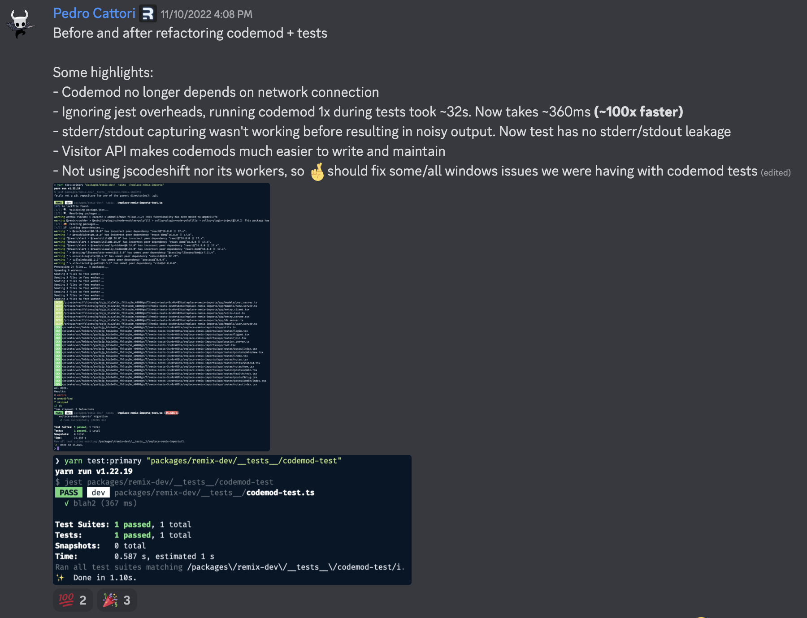

# The memories folder

When you start a new ~job~ adventure, create a `memories` folder for it.
Then, whenever you're excited/proud/happy about your work, screenshot it and stick it into `memories`.

When you feel demotivated or unconfident, take a peek at your `memories`.
Seeing those victories will help you **remember that you are awesome**.

You're so awesome in fact that you probably deserve a raise!
Luckily, your `memories` are also a list of your achievements,
so call on them when you **negotiate that promotion** with your boss.

Finally, when it's time for you to move on to your next thing,
**write a kickass goodbye email** where you share your favorite `memories`.[^discovering-memories]

[^discovering-memories]:
    I discovered `memories` when a coworker wrote _their_ kickass goodbye email.
    Now, I'm paying it forward to you.

To give you an idea, here are some of the things in my `Remix memories` folder.
A mix of small wins, funny quirks, and seeing others enjoy what I've built.
They make me smile everytime I see them.

👆 Jacob and I were pairing on types for Remix `defer` and he accidentally committed `"wtf"` instead of `never` 🤣

👆 Feels great to get some appreciated for the `loader` type inference.
Shout out to [@colinhacks](https://twitter.com/colinhacks) and [@mattpocockuk](https://twitter.com/mattpocockuk) for that one!

👆 Should have fixed the dev server to produce clean builds a while ago 😅
Loved to see how happy it made some people to finally get that fix in.

👆 Test code maintenance isn't why I get up in the morning, but proud of this ~100x improvement.
To be fair, _I did_ introduce `jscodeshift` into our codebase, so this is 10x cleaning up my mistake and another 10x of actual improvements.
